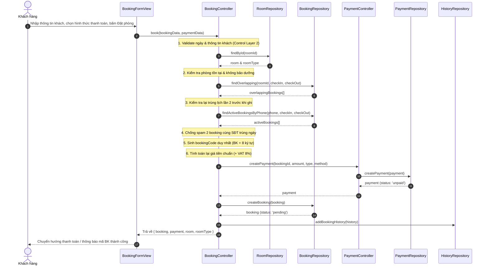

# HỆ THỐNG KIỂM TRA PHÒNG TRỐNG VÀ ĐẶT PHÒNG KHÁCH SẠN
> **Đồ án môn học:** Công nghệ Phần mềm  
> **Bài 2 – Mục 4 (Lập trình):** Kiểm tra phòng trống và đặt phòng  
> **Kiến trúc ứng dụng:** Boundary – Control – Entity (BCE)  
> **Công nghệ:** Vite + TypeScript (Vanilla DOM, không dùng framework UI), TailwindCSS, json-server, concurrently.

---

## 1. HƯỚNG DẪN KHỞI CHẠY DỰ ÁN

Dự án được cấu hình độc lập cổng để tránh xung đột với các ứng dụng khác đang chạy trên máy (`json-server` cổng **3002**, `Vite dev server` cổng **5174**).

Chạy hệ thống bằng đúng 2 bước lệnh:

```bash
# Bước 1: Cài đặt thư viện phụ thuộc
npm install

# Bước 2: Khởi chạy đồng thời CSDL (json-server) và Giao diện (Vite)
npm run dev
```

- **Giao diện người dùng:** [http://localhost:5174](http://localhost:5174)
- **API CSDL (json-server):** [http://localhost:3002](http://localhost:3002)

---

## 2. TÀI KHOẢN NHÂN VIÊN MẪU (SEED DATA)

Khu vực nhân viên truy cập tại đường dẫn `#/staff` hoặc `#/staff/login`. Mật khẩu được băm chuẩn **SHA-256** qua Web Crypto API, không lưu plaintext:

| Vai trò | Tên đăng nhập | Mật khẩu gốc | Hash SHA-256 lưu trong `db.json` |
| :--- | :--- | :--- | :--- |
| **Quản trị viên** | `admin` | `123456` | `8d969eef6ecad3c29a3a629280e686cf0c3f5d5a86aff3ca12020c923adc6c92` |
| **Lễ tân** | `receptionist` | `123456` | `8d969eef6ecad3c29a3a629280e686cf0c3f5d5a86aff3ca12020c923adc6c92` |

---

## 3. DỮ LIỆU SEED KIỂM THỬ ĐẶC TRƯNG TRONG `db.json`

Dữ liệu mẫu được cấu hình đầy đủ để phục vụ kiểm thử mọi kịch bản nghiệp vụ:

1. **Phòng nhiều loại & sức chứa khác nhau:**
   - `RT01 - Standard Double`: Sức chứa 2 khách, đơn giá 500.000 đ/đêm.
   - `RT02 - Deluxe King`: Sức chứa 3 khách, bồn tắm nằm, đơn giá 850.000 đ/đêm.
   - `RT03 - Family Suite`: Sức chứa 5 khách, 2 phòng ngủ, đơn giá 1.500.000 đ/đêm.
2. **Phòng bảo dưỡng (`maintenance`):**
   - Phòng `103`: Bị loại bỏ hoàn toàn khỏi kết quả tìm kiếm với mọi khoảng ngày.
3. **Kiểm tra trùng lịch nửa mở `[checkIn, checkOut)`:**
   - Phòng `101` đã có booking `B001` (`BKTEST01`) chiếm lịch từ **`2026-09-22`** đến **`2026-09-25`**.
   - *Test hợp lệ:* Tìm ngày `2026-09-20` đến `2026-09-22` -> Phòng 101 **vẫn hiển thị trống** (vì khách trước trả phòng lúc 12:00 ngày 22, khách sau nhận phòng lúc 14:00 ngày 22).
   - *Test trùng lịch:* Tìm ngày `2026-09-23` đến `2026-09-26` -> Phòng 101 **bị ẩn đi**.
4. **Kiểm tra 3 bậc chính sách hoàn tiền khi hủy phòng:**
   - Booking `B002` (`BKREFU01` - SĐT: `0987654321`): Ngày nhận `2026-09-30` ($\ge 7$ ngày) -> **Hoàn tiền 100%**.
   - Booking `B003` (`BKREFU02` - SĐT: `0903123456`): Ngày nhận `2026-09-24` (3 đến 6 ngày) -> **Hoàn tiền 50%**.
   - Booking `B004` (`BKREFU03` - SĐT: `0912999888`): Ngày nhận `2026-09-21` ($< 3$ ngày) -> **Hoàn tiền 0%**.
5. **Kiểm tra ràng buộc xóa phòng của Nhân viên:**
   - Thử xóa Phòng `101` hoặc `201` -> Hệ thống chặn xóa và thông báo rõ số lượng booking đang vướng.

---

## 4. KIẾN TRÚC BOUNDARY – CONTROL – ENTITY (BCE)

Dự án áp dụng chặt chẽ mô hình phân tầng BCE môn Công nghệ phần mềm:
- **Boundary (`src/boundary/`)**: Tiếp nhận tương tác người dùng, render DOM bằng tay thuần TypeScript, hiển thị lỗi inline dưới field, bắt sự kiện và gọi Controller tương ứng. Không gọi trực tiếp Repository hay CSDL.
- **Control (`src/control/`)**: Tiếp nhận yêu cầu nghiệp vụ, gọi Validation kiểm tra lần 2, điều phối xử lý qua Repository và thực thi State Machine của Entity.
- **Entity (`src/entities/`)**: Định nghĩa kiểu dữ liệu thuần túy và cài đặt State Machine kiểm soát quy tắc chuyển trạng thái hợp lệ.
- **Repository (`src/repository/`)**: **Nơi duy nhất** thực hiện `fetch()` tới máy chủ `json-server` (cổng 3002). Độc lập với giao diện, bọc try/catch chống sập ứng dụng.
- **Validation (`src/validation/`)**: Các hàm kiểm tra độc lập (pure functions), trả về mã lỗi và thông điệp tiếng Việt cụ thể.

```mermaid
flowchart LR
    subgraph Boundary ["Boundary (Giao diện)"]
        V1["RoomSearchView"]
        V2["RoomDetailView"]
        V3["BookingFormView"]
        V4["PaymentView"]
        V5["BookingLookupView"]
        V6["StaffViews"]
    end

    subgraph Control ["Control (Bộ điều khiển nghiệp vụ)"]
        C1["RoomController"]
        C2["BookingController"]
        C3["PaymentController"]
        C4["StaffController"]
    end

    subgraph Validation ["Validation (Kiểm tra dữ liệu)"]
        VAL["dateValidator<br/>customerValidator<br/>searchValidator<br/>roomValidator"]
    end

    subgraph Repository ["Repository (Tầng truy cập dữ liệu)"]
        R1["RoomRepository"]
        R2["BookingRepository"]
        R3["PaymentRepository"]
        R4["StaffRepository"]
    end

    subgraph Database ["CSDL json-server :3002"]
        DB[("db.json")]
    end

    Boundary -->|Gọi hàm nghiệp vụ| Control
    Control -->|Kiểm tra quy tắc| Validation
    Control -->|Đọc / Ghi dữ liệu| Repository
    Repository -->|fetch() HTTP REST| Database
```

---

## 5. MÔ TẢ LUỒNG SEQUENCE & COLLABORATION USE CASE TRỌNG TÂM: "KHÁCH HÀNG ĐẶT PHÒNG"

Khớp chính xác tên class và method trong mã nguồn dự án:



---

## 6. CÔNG THỨC KIỂM TRA PHÒNG TRỐNG (KHOẢNG NỬA MỞ $[A, B)$)

Quy ước giờ khách sạn: Nhận phòng lúc 14:00, Trả phòng lúc 12:00 cùng ngày. Do đó khoảng lưu trú là khoảng nửa mở $[checkInDate, checkOutDate)$.

Hai booking $A$ và $B$ xảy ra xung đột (trùng lịch) khi và chỉ khi:
$$\mathbf{A.checkIn < B.checkOut \quad \land \quad B.checkIn < A.checkOut}$$

Hàm được viết riêng biệt tại `src/utils/dateUtils.ts`:
```typescript
export function isOverlapping(
  startA: string,
  endA: string,
  startB: string,
  endB: string
): boolean {
  return startA < endB && startB < endA;
}
```
* **Chỉ xét trùng với booking có status** $\in$ `{ 'pending', 'confirmed', 'checked_in' }`. Booking `cancelled`, `checked_out`, `no_show` không chặn lịch.
* **Phòng bảo dưỡng (`maintenance`):** Bị loại khỏi kết quả tìm kiếm với mọi khoảng ngày.

---

## 7. BẢNG TỔNG HỢP QUY TẮC VALIDATION & NGHIỆP VỤ

| Phân hệ / Đối tượng | Quy tắc kiểm tra | Xử lý vi phạm |
| :--- | :--- | :--- |
| **Ngày nhận / trả phòng** | Định dạng `YYYY-MM-DD`, phải là ngày có thực trong lịch (kiểm tra ngày nhuận 29/02, từ chối 31/02...). | Báo lỗi inline: "Ngày không hợp lệ hoặc không tồn tại trong lịch." |
| | `checkInDate >= hôm nay` (giờ địa phương, không lệch timezone). | Báo lỗi: "Ngày nhận phòng không được ở quá khứ." |
| | `checkOutDate > checkInDate` (tối thiểu 1 đêm, không cho phép bằng nhau). | Báo lỗi: "Ngày trả phòng phải sau ngày nhận ít nhất 1 đêm." |
| | $1 \le nights \le 30$; không đặt trước quá 365 ngày. | Báo lỗi thời gian lưu trú vượt giới hạn. |
| **Thông tin khách hàng** | Họ tên 2–50 ký tự, cho phép tiếng Việt có dấu, không chứa số / ký tự lạ. | Báo lỗi inline dưới ô Họ tên. |
| | SĐT regex chuẩn Việt Nam `^(0\|\+84)(3\|5\|7\|8\|9)[0-9]{8}$`. | Báo lỗi inline định dạng SĐT. |
| | Email chuẩn RFC, $\le 100$ ký tự (để gửi mã đặt phòng). | Báo lỗi inline định dạng Email. |
| | `adults >= 1`, `children >= 0`; chặn gõ phím `+`, `-`, `e`, `.`. | Chặn nhập số âm, thập phân hoặc ký tự lạ. |
| | `adults + children <= capacity` của loại phòng. | Báo lỗi: "Phòng này chỉ chứa tối đa N khách." |
| **Tính tiền & VAT** | Số nguyên VNĐ; $VAT = \text{round}(\text{Tiền phòng} \times 0.08)$; Tính lại ở Control. | View không thể giả mạo giá tiền. |
| **Thanh toán** | Số tiền gửi lên phải đúng bằng $100\%$ hoặc đúng $30\%$ tiền cọc. Không thanh toán 2 lần hoặc thanh toán đơn đã hủy. | Báo lỗi không khớp số tiền cần thanh toán. |
| **Tra cứu đặt phòng** | Bắt buộc đúng cả **Mã đặt phòng (BK...)** và **Số điện thoại**. | Báo lỗi chung: "Không tìm thấy thông tin đặt phòng phù hợp". |
| | Giới hạn thử sai: 5 lần sai trong vòng 60 giây. | Khóa tạm thời 60 giây (Rate limiting). |
| **Hủy phòng trực tuyến** | Chỉ cho hủy khi `status ∈ {pending, confirmed}` và `hôm nay < checkInDate`. | Báo rõ lý do không được hủy. |
| | **Chính sách hoàn tiền:** $\ge 7$ ngày hoàn 100%; $3 - 6$ ngày hoàn 50%; $< 3$ ngày hoàn 0%. | Hiển thị bảng tính hoàn tiền trước, bắt xác nhận 2 bước. |
| **Quản lý phòng (Staff)** | `roomNumber` duy nhất; `floor >= 1`; Không cho xóa phòng đang có booking `pending`/`confirmed`/`checked_in`. | Báo rõ số lượng booking đang vướng, từ chối xóa. |
| | Đổi sang `available` khi có khách `checked_in`. | Từ chối chuyển trạng thái. |
| | Đổi sang `maintenance` khi có booking xác nhận trong 7 ngày tới. | Cảnh báo lịch đặt, yêu cầu xác nhận 2 bước. |
| **Đăng nhập nhân viên** | So sánh băm SHA-256 Web Crypto API; Giới hạn 5 lần đăng nhập sai / 60 giây. | Khóa tạm tài khoản trong 60 giây. |

---

## 8. CẤU TRÚC MÃ NGUỒN CHI TIẾT

```text
src/
├── entities/                  # Thực thể & State Machine
│   ├── Room.ts                # Room, RoomType, RoomStatus, RoomStateMachine
│   ├── Booking.ts             # Booking, BookingStatus, BookingStateMachine
│   ├── Payment.ts             # Payment, PaymentMethod, PaymentType, PaymentStatus
│   ├── Staff.ts               # Staff
│   ├── History.ts             # RoomStatusHistory, BookingHistory
│   └── AppError.ts            # Định nghĩa lớp lỗi chung AppError
├── validation/                # Validator thuần túy
│   ├── dateValidator.ts       # Kiểm tra tính hợp lệ ngày, lịch, nhuận
│   ├── customerValidator.ts   # Kiểm tra thông tin khách và sức chứa
│   ├── searchValidator.ts     # Kiểm tra bộ lọc tìm kiếm và khoảng giá
│   ├── roomValidator.ts       # Kiểm tra thông tin phòng của nhân viên
│   ├── paymentValidator.ts    # Kiểm tra số tiền thanh toán
│   └── lookupValidator.ts     # Kiểm tra mã BK và SĐT tra cứu
├── repository/                # Tầng duy nhất gọi fetch() tới json-server
│   ├── apiConfig.ts           # Bọc fetch, phát hiện mất mạng / json-server offline
│   ├── RoomRepository.ts      # Thao tác CSDL phòng và loại phòng
│   ├── BookingRepository.ts   # Thao tác CSDL đặt phòng & trùng lịch
│   ├── PaymentRepository.ts   # Thao tác CSDL thanh toán
│   ├── StaffRepository.ts     # Thao tác CSDL nhân viên
│   └── HistoryRepository.ts   # Thao tác CSDL lịch sử biến động
├── control/                   # Tầng xử lý logic nghiệp vụ
│   ├── RoomController.ts      # Tìm kiếm phòng trống, tính giá, CRUD phòng
│   ├── BookingController.ts   # Luồng đặt phòng, tra cứu, hủy & hoàn tiền
│   ├── PaymentController.ts   # Nghiệp vụ thanh toán & xử lý giao dịch
│   └── StaffController.ts     # Đăng nhập (SHA-256), phê duyệt đơn, Check-in/out
├── boundary/                  # Giao diện người dùng (Vanilla TS DOM)
│   ├── components/            # UI components (Toast, Modal, Navbar, Pagination, NetworkBanner)
│   ├── customer/              # Giao diện khách hàng (Tìm phòng, Đặt phòng, Thanh toán, Tra cứu/Hủy)
│   └── staff/                 # Giao diện nhân viên (Đăng nhập, Dashboard, Quản lý phòng, Duyệt đơn)
└── utils/                     # Tiện ích bổ trợ
    ├── dateUtils.ts           # isOverlapping(), calculateNights(), format ngày
    ├── money.ts               # Định dạng VNĐ, VAT 8%, cọc 30%, tính hoàn tiền
    ├── bookingCode.ts         # Sinh mã đặt phòng BK + 8 ký tự
    ├── crypto.ts              # Băm mật khẩu SHA-256 Web Crypto API
    ├── rateLimiter.ts         # Bộ đếm giới hạn thử sai (5 lần / 60 giây)
    ├── router.ts              # Router hash SPA & Guard phân hệ staff
    ├── sanitize.ts            # Escape HTML chống XSS, chuẩn hóa chuỗi
    └── session.ts             # Quản lý phiên đăng nhập nhân viên
```
